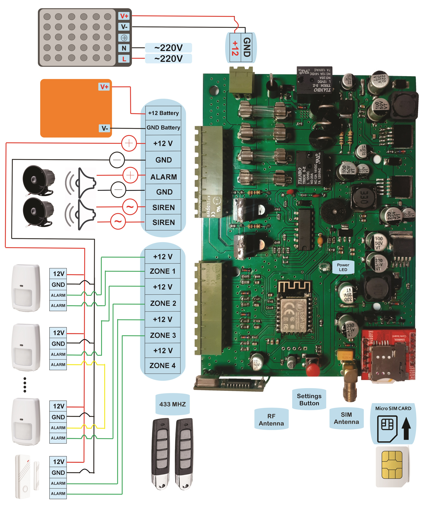
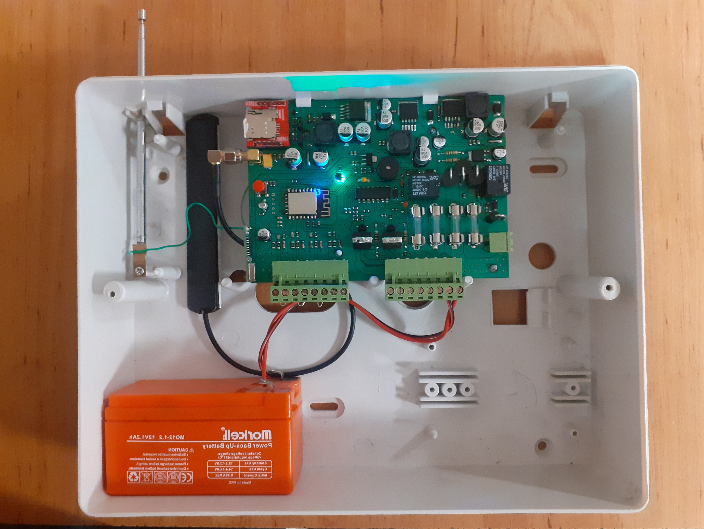

# Home-Security-System-Based-on-SIM800

Home security system based on SIM800 is a security system that uses a SIM card to send and receive text messages. It is designed to detect any unauthorized entry into a home and alert the homeowner via text message and call to their mobile phone. The system made up of a control panel (main board), sensors, and sirens. The sensors can be placed on doors, windows, and other areas around the home to detect any movement or disturbance. When the sensors are triggered, the control panel sends a few call and text message to the homeowner's phone, notifying them of the disturbance. This type of home alarm system is often preferred by those who want to be alerted of any security breaches immediately, even if they are not at home. Additionally, this type of system can be controlled remotely via text message, allowing the homeowner to turn the system on or off, and to check its status from anywhere at any time.

 

 

## Features

-  ZONE:
    -  4 wired zones
    -  10 wireless zones for connecting wireless sensors

-  Remote controller:
    -  Learning 10 remote controllers
      
-  Caller memory:
    -  10 mobile phone number storage memory
      
-  Battery charger:
    -  internal charging and battery protection circuit

 -  Internal siren circuit:
    -  45 watt internal siren circuit

 -  External antenna socket:
    -  SMA socket to connect the SIM800 antenna

 -  IOT:
    -  Internet connection via Wi-Fi

 -  SMS:
    -  Control(on, off, settings) via SMS
      
 

 

