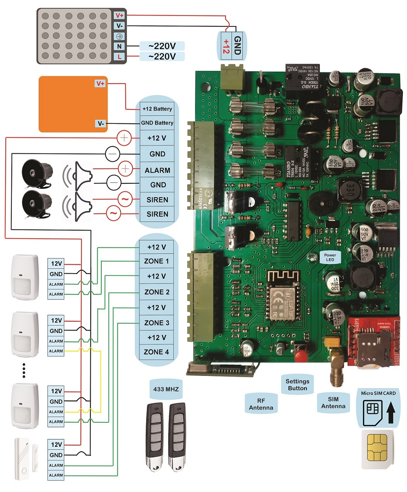

# Home-Security-System-Based-on-SIM800

Home security system based on SIM800 is a security system that uses a SIM card to send and receive text messages. It is designed to detect any unauthorized entry into a home and alert the homeowner via text message and call to their mobile phone. The system made up of a control panel (main board), sensors, and sirens. 

The sensors can be placed on doors, windows, and other areas around the home to detect any movement or disturbance. When the sensors are triggered, the control panel sends a few calls and text messages to the homeowner's phone, notifying them of the disturbance. This type of home alarm system is often preferred by those who want to be alerted of any security breaches immediately, even if they are not at home. 

Additionally, this type of system can be controlled remotely via text message, allowing the homeowner to turn the system on or off, and to check its status from anywhere at any time.

### This project has been tested more than 4000 hours...

<div align="center"><a href="#"></a><br></div>
<div align="center"><a href="#"></a><br></div>
<div align="center"><a href="#"></a><br></div>
<br/>

## Features

-  ZONE:
    -  4 wired zones
    -  10 wireless zones for connecting wireless sensors

-  Remote controller:
    -  Supports 10 remote controllers
      
-  Caller memory:
    -  Stores up to 10 mobile phone numbers
      
-  Battery charger:
    -  Equipped with an internal charging and battery protection circuit

 -  Internal siren circuit:
    -  Features a 45-watt internal siren circuit

 -  External antenna socket:
    -  Includes an SMA socket for connecting the SIM800 antenna

 -  IOT:
    -  Allows for internet connection via Wi-Fi

 -  SMS:
    -  Control (on, off, settings) via SMS.
      
<br/>

## Setup


### Hardware setup

|   Setup  | Description |
| ----------- | ----------- |
| Learn wireless sensor     | After configuring the sensor address jumpers, press and hold the button on the board for 3 seconds until the board emits 2 consecutive beeps. Now, release the button quickly and move the wireless sensor (connect the sensor power) if you want to learn the sensor. The board will emit 2 consecutive beeps to confirm successful learn. If an error occurs during the learn process, the board will emit only one beep.        |
| Remove the wireless sensor     | Press and hold the setting button on the board for 3 seconds until the board emits 2 consecutive beeps. Now, quickly release the button and activate the wireless sensor (connect the sensor's power). If the sensor is successfully removed, the board will emit 3 beeps. If there is an error in the deletion process, the board will emit only one beep (similar to the repetition in the sensor Learn process).        |
| Learn the remote's Activate button     |   Press and hold the button on the board for 6 seconds until the board emits 3 consecutive beeps. Now, quickly press the activate button on the remote control. If you successfully learn this button to your device, the board will emit 2 consecutive beeps. If there is an error in the learn process, the board will emit only one beep. |
| Remove the remote's Activate button    | Press and hold the button on the board for 6 seconds until the board emits 3 consecutive beeps. Now, quickly release the button and press the activate button on the remote control. If you successfully remove this button from the device, the board will emit 3 consecutive beeps. If there is an error in the deletion process, the board will emit only one beep. |
| Learn the remote's Disable button     |  Press and hold the button on the board for 9 seconds until the board emits 4 consecutive beeps. Now, quickly press the disable button on the remote control. If you successfully learn this button to your device, the board will emit 2 consecutive beeps. If there is an error in the learn process, the board will emit only one beep.         |
| Remove the remote's Disable button     |  Press and hold the button on the board for 9 seconds until the board emits 4 consecutive beeps. Now, quickly release the button and press the disable button on the remote control. If you successfully remove this button from the device, the board will emit 3 consecutive beeps. If there is an error in the deletion process, the board will emit only one beep.|
| Cancel the Learn or Remove process     | If you encounter any issues during the process of learn or remove the sensor or remote, or if you wish to cancel the process, simply press the settings button on the board. The device will notify you by emitting a single beep and cancel the process.    |
| Erase all remotes and sensors     | If you wish to erase all the data and settings on the device, including mobile phone numbers, sensors, activate and disable buttons of remotes, and more, simply hold the button on the device for 20 seconds until the board emits 5 consecutive beeps. Once you release the button, the device's memory will be completely erased.        |


### SMS setup

|    Setup   | Instruction |
| ----------- | ----------- |
| Save mobile number      |<UniqueCode; mobile number> for example :  ```RIJ111111111111111;09191111111```        |
| Getting the status mobile number      | < UniqueCode > for example :  ```RIJ111111111111111```        |
| Delete mobile number     | <Special code; mobile number saved> for example :  ```RIJ111111111111111;09191111111```         |
| Activate the device      |  ```RIJ ON```        |
| Disable the device      |  ```RIJ OFF```        |
| Activate the alarm      | ```RIJ SIREN ON```        |
| Disable the alarm    | ```RIJ SIREN OFF```        |
| Activate  the notification beep     | ```RIJ BEEP ON```        |
| Disable the notification beep     | ```RIJ BEEP OFF```        |
| Enable zones      | <RIJ ZONE "Number" ON> for example :  ```RIJ ZONE 1 ON```        |
| Disable zones  | <RIJ ZONE "Number" OFF> for example :  ```RIJ ZONE 1 OFF```        |
| Set the Alarm time   | <RIJ SIREN "Minutes"> for example :  ```RIJ SIREN 15```         |
| Send USSD code | <RIJ UCODE:"Code"> for example :  ```RIJ UCODE:*11111*11111#```     |
| Set the device time | <RIJ SET TIME: "Time"+"Time Zone"> for example :  ```RIJ SET TIME:22/05/09,23:59:59+18```     |
| Getting the Status of the device | ```RIJ STATUS```     |
| Getting the Status of zones | ```RIJ STATUS ZONE```     |
| Reset the device | ```RIJ RESET```     |

### For detailed information ```Src/COM.ino```


## License
[MIT License](LICENSE)

Free Hardware!
